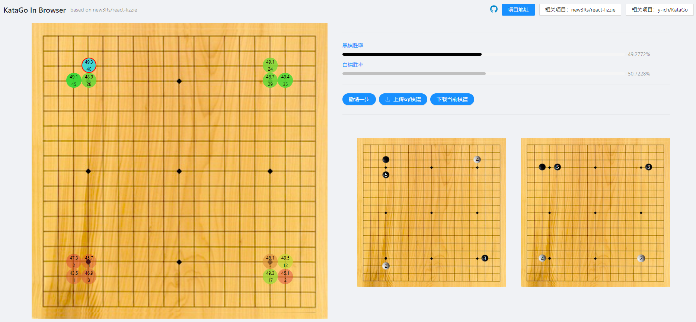

# Web KataGo

Based on [new3Rs/react-lizzie](https://github.com/new3Rs/react-lizzie)

## Demo
Website1:
[http://www.linton.ren:3000](http://www.linton.ren:3000)
<br/>
Website2:
[http://124.70.76.170:3000](http://124.70.76.170:3000)

**Please adjust a proper browser zoom scale to get the best experience**
<br/>
**Only Support latest Edge and Chrome on PC**



## install dependency
```
yarn install
```

## start
```
yarn start
```

## Deploy on your server
```
yarn build
serve -s build /* latest node version */
```

## License
MIT